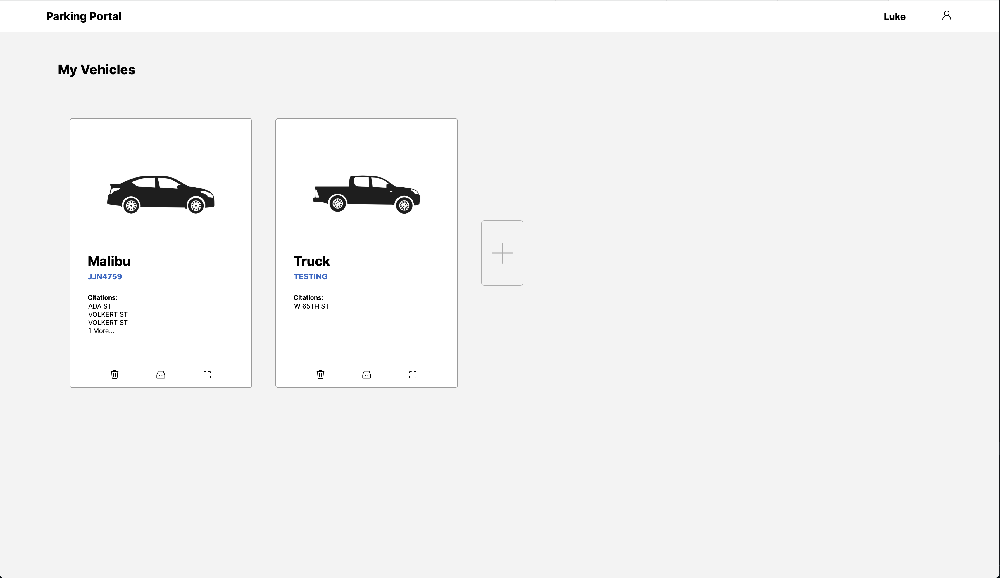
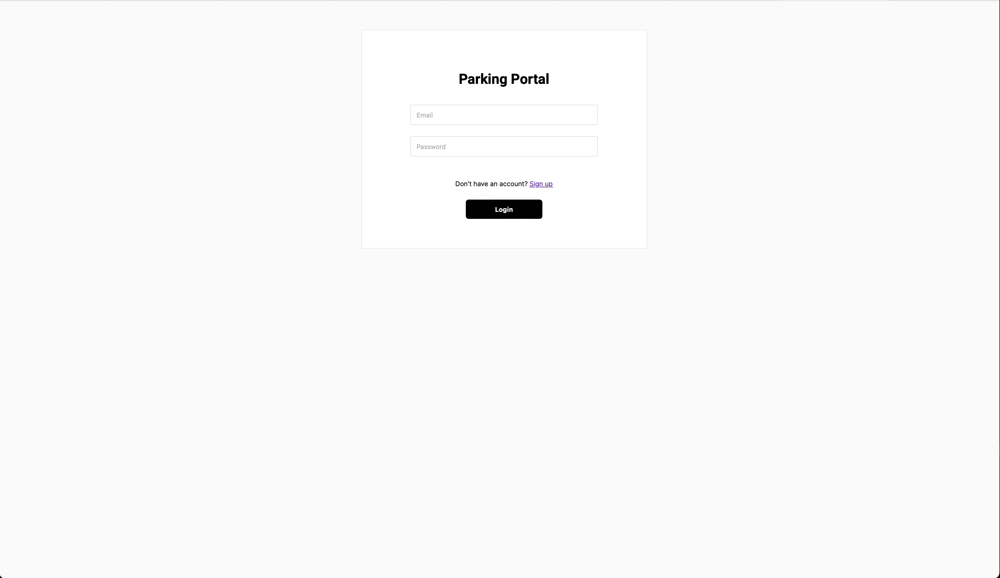
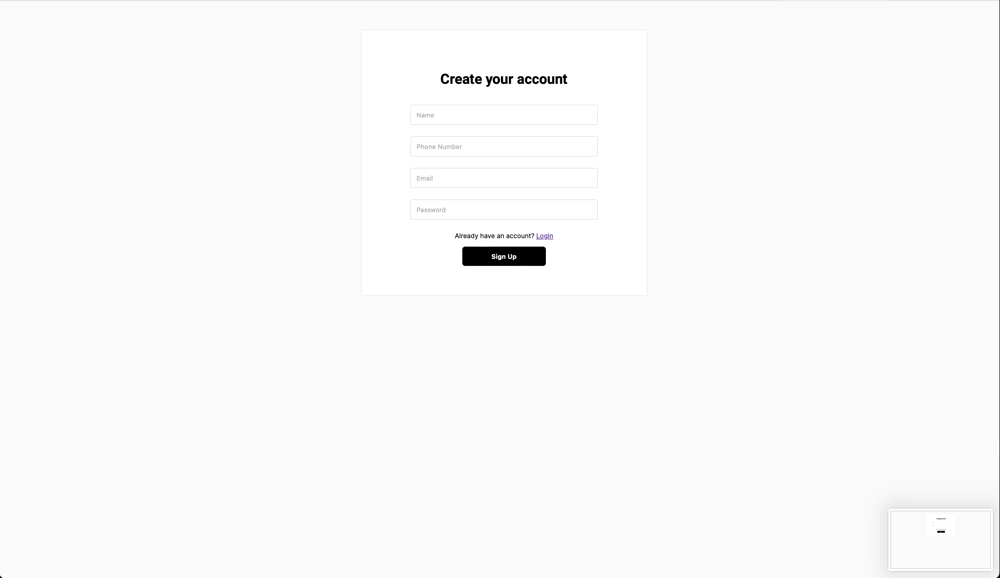
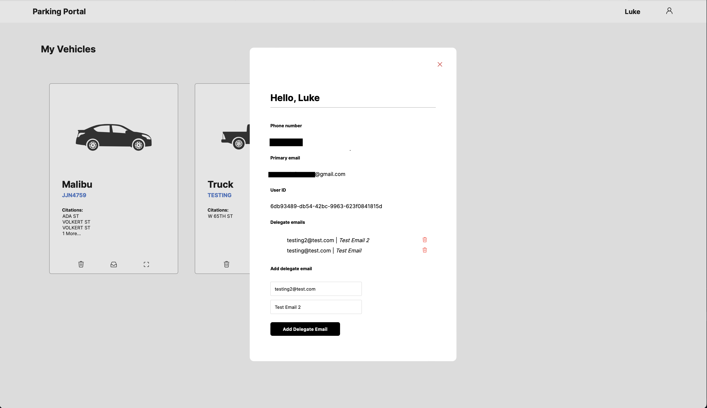
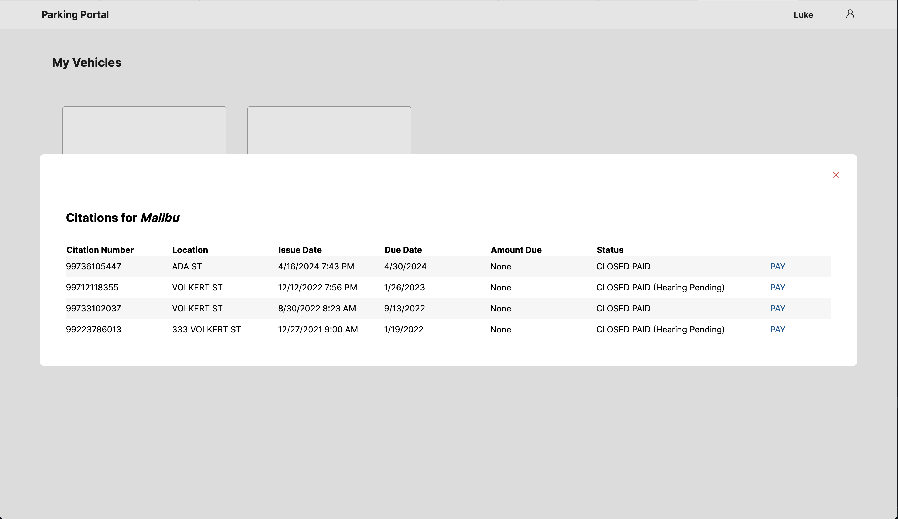
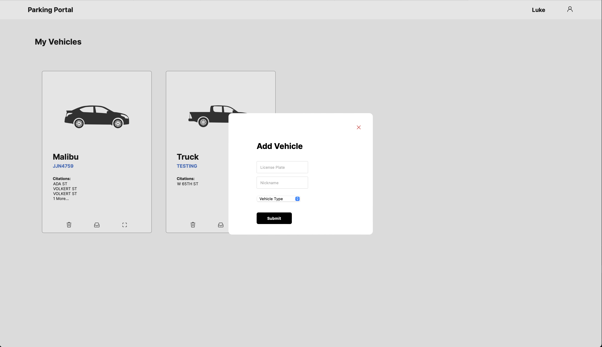
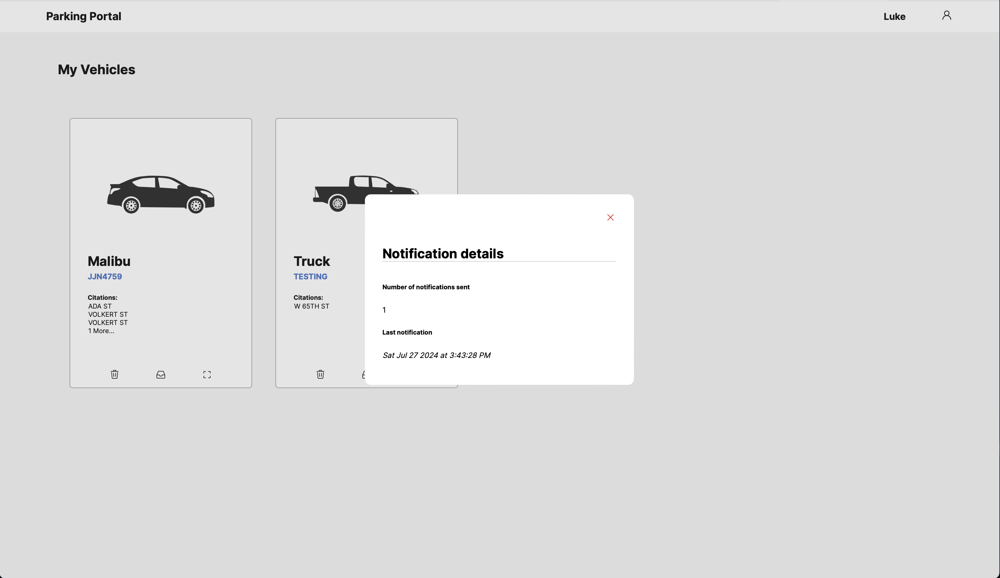

# Parking Infraction Portal
This is a redesign on the [cincinnati citation portal](https://cincinnati.citationportal.com)

## Features:
- User accounts to track the citations and cost for multiple vehicles.
- Built in email notification system to notify users promptly of any new citations that occur.
- Multiple emails supported so user's friends and family can also be in the loop on late fines and other parking infraction issues.
- Smooth and user friendly interface for viewing and paying parking infractions.

### Development Stack
A backend API is created using Python FastAPI. This API communicates with an SQLite database which stores all relevant information. The front end is built using React with NextJS and TypeScript. NextJS serves as the backend serving the frontend, however, most of the backend implementation is coming from the API. 

# Getting started

### Building the database
In the `api` directory run the command below to build the backend database.
```
python3 construct_db
```

### Starting the API server
Staying in the same directory run:
```
fastapi dev portal_api.py
```
This kicks off the API server so the web server can start making requests

### Building the frontend with NextJS
Navigate to the `frontend/app` directory and run:
```
npm i
npm run dev
```
This installs all the neccessary packages and then starts the web server for NextJS. 

### Navigation
If you navigate to [`http://localhost:3000/accounts/signup`](http://localhost:3000/accounts/signup) you should be able to create an account and see the dashboard.

### Notes about email integration
This app relies on an SMTP connection to a mail client. You will need to set up an email account and enable SMTP Auth in order for your user to be able to manage notifications.

# UI screenshots






